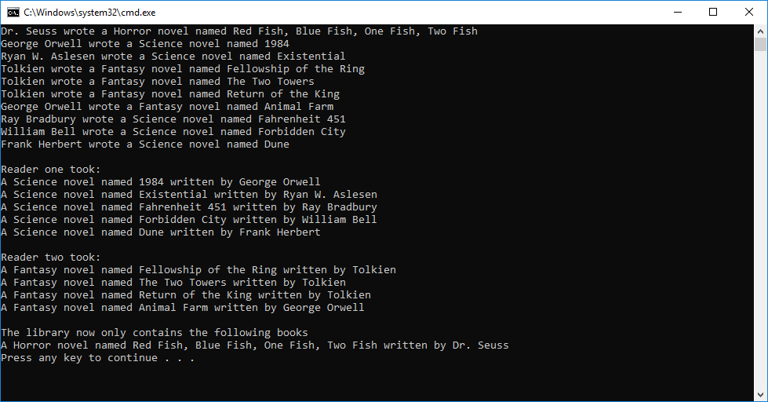

# Collections
#### Lab07-Collections
##### *Author: Daniel Logerstedt*

------------------------------

## Description

This is a C# implementation of a Enumerable that holds Generic items. It is themed with Library and Books with Authors but could be reimplemented to just be a List of any type of data.

------------------------------

## Getting Started
Clone this repository to your local machine.
```
$ git clone https://github.com/daniellogerstedt/Lab07-Collections
```
#### To run the program from Visual Studio:
Select ```File``` -> ```Open``` -> ```Project/Solution```

Next navigate to the location you cloned the Repository.

Double click on the ```Lab07-Collections``` directory.

Then select and open ```LendingLibrary.sln```

------------------------------

## Visuals
***[Add screenshots of your application in action]***

##### Application Demo


------------------------------

## Change Log
